# Rapport de projet — CSC8607 : Introduction au Deep Learning

> **Consignes générales**
> - Tenez-vous au **format** et à l’**ordre** des sections ci-dessous.
> - Intégrez des **captures d’écran TensorBoard** lisibles (loss, métriques, LR finder, comparaisons).
> - Les chemins et noms de fichiers **doivent** correspondre à la structure du dépôt modèle (ex. `runs/`, `artifacts/best.ckpt`, `configs/config.yaml`).
> - Répondez aux questions **numérotées** (D1–D11, M0–M9, etc.) directement dans les sections prévues.

---

## 0) Informations générales

- **Étudiant·e** : _Delière, Yohan_
- **Projet** : _Intitulé (dataset × modèle)_
- **Dépôt Git** : _[URL publique](https://github.com/lelierre-dev/csc8607_project1)_
- **Environnement** : `python == 3.13.3`, `torch == 2.9.1`, `mps ==  Metal 4`  
- **Commandes utilisées** :
  - Entraînement : `python -m src.train --config configs/config.yaml`
  - LR finder : `python -m src.lr_finder --config configs/config.yaml`
  - Grid search : `python -m src.grid_search --config configs/config.yaml`
  - Évaluation : `python -m src.evaluate --config configs/config.yaml --checkpoint artifacts/best.ckpt`

---

## 1) Données

### 1.1 Description du dataset
- **Source** (lien) : Tiny ImageNet (HuggingFace Datasets : https://huggingface.co/datasets/zh-plus/tiny-imagenet)
- **Type d’entrée** : images RGB.
- **Tâche** : classification multiclasses
- **Dimensions d’entrée attendues** : `meta["input_shape"] = (3, 64, 64)`
- **Nombre de classes** : `meta["num_classes"] = 200`

**D1.** Quel dataset utilisez-vous ? D’où provient-il et quel est son format (dimensions, type d’entrée) ?

Dataset Tiny ImageNet, 200 classes, images 64×64×3 (RGB), utilisé via le hub HuggingFace.


### 1.2 Splits et statistiques

| Split | #Exemples | Particularités (déséquilibre, longueur moyenne, etc.) |
|------:|----------:|--------------------------------------------------------|
| Train |  100 000	|    200 classes, répartition uniforme (500 images/classe)  |
| Val   |  10 000   |    Uniforme (~50 images/classe)                            |
| Test  |  10 000   |    Identique à val dans ce dépôt (pas de split test officiel séparé)   |

**D2.** Donnez la taille de chaque split et le nombre de classes. 
100k train, 10k val, 200 classes. 
**D3.** Si vous avez créé un split (ex. validation), expliquez **comment** (stratification, ratio, seed).
Splits fournis par le dataset (train/validation). Pas de création de split custom.

**D4.** Donnez la **distribution des classes** (graphique ou tableau) et commentez en 2–3 lignes l’impact potentiel sur l’entraînement.

Tiny ImageNet est équilibré, environ 500 images par classe en train (100k au total) et 50 par classe en val/test (10k). Pas de déséquilibre notable, donc pas besoin de pondération de classes ou de sampling spécial. L’entraînement est stable  

**D5.** Mentionnez toute particularité détectée (tailles variées, longueurs variables, multi-labels, etc.).

Non, images RGB 64×64 homogènes.

### 1.3 Prétraitements (preprocessing) — _appliqués à train/val/test_

Listez précisément les opérations et paramètres (valeurs **fixes**) :

- Vision : resize = None, center-crop = None, normalize = (mean=[0.485, 0.456, 0.406], std=[0.229, 0.224, 0.225])

**D6.** Quels **prétraitements** avez-vous appliqués (opérations + **paramètres exacts**) et **pourquoi** ?  

Normalisation ImageNet pour stabiliser l’optimisation et aligner les statistiques sur un modèle vision standard. je n'ai pas de resize/crop car les images sont déjà 64×64.

**D7.** Les prétraitements diffèrent-ils entre train/val/test (ils ne devraient pas, sauf recadrage non aléatoire en val/test) ?

Le preprocessing identique sur les trois splits ; seule l’augmentation (flip/crop/jitter) est appliquée au train uniquement

### 1.4 Augmentation de données — _train uniquement_

- Liste des **augmentations** (opérations + **paramètres** et **probabilités**) :
  - Flip horizontal p=0.5, RandomCrop size = 64 avec padding 4. ColorJitter (brightness=0.2, contrast=0.2, saturation=0.2, hue=0.05).

**D8.** Quelles **augmentations** avez-vous appliquées (paramètres précis) et **pourquoi** ?

j'ai augmenté la diversité visuelle (symétries, légers recadrages/padding, variations de couleur) pour limiter l’overfit.  

**D9.** Les augmentations **conservent-elles les labels** ? Justifiez pour chaque transformation retenue.
les transformations géométriques légères, flip et colorimétriques ne changent pas la classe.

### 1.5 Sanity-checks

- **Exemples** après preprocessing/augmentation (insérer 2–3 images) :

> _Insérer ici 2–3 captures illustrant les données après transformation._

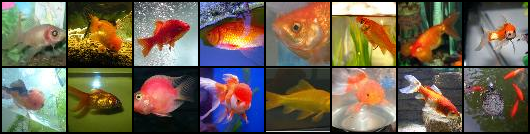


**D10.** Montrez 2–3 exemples et commentez brièvement.  

Les 16 mêmes images sont montrées avant/après augmentation. On voit un léger décalage dû au RandomCrop (padding 4), des flips horizontaux, et des variations de teinte/luminosité (ColorJitter). Les sujets restent reconnaissables, ce qui confirme que les labels sont préservés

**D11.** Donnez la **forme exacte** d’un batch train (ex. `(batch, C, H, W)` ou `(batch, seq_len)`), et vérifiez la cohérence avec `meta["input_shape"]`.

 Forme d’un batch train : (batch_size, 3, 64, 64). avec la config actuelle dans config.yaml, (128, 3, 64, 64). Cela correspond à meta["input_shape"] = (3, 64, 64)

---

## 2) Modèle

### 2.1 Baselines

**M0.**
- **Classe majoritaire** — Métrique : `accuracy (top-1)` → score = ` environ 0.5%` (1/200)
- **Prédiction aléatoire uniforme** — Métrique : `accuracy (top-1)` → score = `0.5%` (espérance)

_Commentez en 2 lignes ce que ces chiffres impliquent._

Dataset équilibré : la prédiction constante ou aléatoire donnent le même plafond très bas (0.5%). Tout modèle doit dépasser nettement cette ligne de base dès les premières époques.

### 2.2 Architecture implémentée 

- **Description couche par couche** (ordre exact, tailles, activations, normalisations, poolings, résiduels, etc.) :
  - Input → Conv3×3 (3→64, bias=False) → BN64 → ReLU → Conv3×3 (64→64, bias=False) → BN64 → ReLU → MaxPool2d(2)
  - Stage 1 (répéter N₁=2 fois) : blocs Conv3×3→BN→ReLU ci-dessus
  - Stage 2 (répéter N₂=2 fois) : Conv3×3 (64→128) → BN128 → ReLU → Conv3×3 (128→128) → BN128 → ReLU → MaxPool2d(2)
  - Stage 3 (répéter N₃=2 fois) : Conv3×3 (128→256) → BN256 → ReLU → Conv3×3 (256→256) → BN256 → ReLU → AdaptiveAvgPool2d(1×1)
  - Tête : flatten → Linear(256 → 200) → logits (dim = 200 classes)

- **Loss function** :
  - Multi-classe : CrossEntropyLoss

- **Sortie du modèle** : forme = __(batch_size, 200)__ (

- **Nombre total de paramètres** : `1 197 704` 

**M1.** Décrivez l’**architecture** complète et donnez le **nombre total de paramètres**.  
Expliquez le rôle des **2 hyperparamètres spécifiques au modèle** (ceux imposés par votre sujet).

Architecture : réseau de convolution en trois étages, déjà détaillé plus haut, avec environ 1 197 704 paramètres. Chaque étage empile deux blocs convolution → normalisation de lot → ReLU, un max-pooling suit les étages 1 et 2, un pooling adaptatif moyen en sortie du troisième, puis aplatissement et couche linéaire 256 → 200 pour les logits.
Hyperparamètres spécifiques :
stage_repeats = [2,2,2] : nombre de blocs convolution-normalisation-ReLU par étage, plus on répète, plus la capacité augmente, ce qui peut améliorer l’ajustement mais aussi l’overfit et le coût de calcul.
stage_channels = [64,128,256] : nombre de canaux par étage, élargir ces valeurs augmente le nombre de caractéristiques apprises et de paramètres, ce qui peut aider la précision mais accroît mémoire, calcul et risque d’overfit.


### 2.3 Perte initiale & premier batch

- **Loss initiale attendue** (multi-classe) ≈ `-log(1/num_classes)` ; pour 200 classe → ~5.3
- **Observée sur un batch** : `5.3097`
- **Vérification** : backward OK, gradients ≠ 0

**M2.** Donnez la **loss initiale** observée et dites si elle est cohérente. Indiquez la forme du batch et la forme de sortie du modèle.

J’ai observé une loss initiale d’environ 5.30 (cohérente avec −log(1/200)), sur un batch de forme (128, 3, 64, 64) donnant une sortie (128, 200). après 50 steps, la loss tourne autour de 5.04 

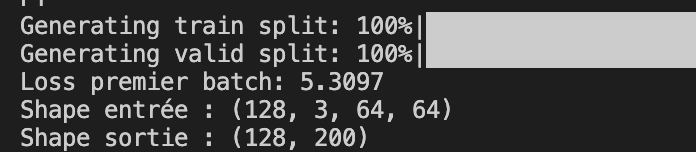

---

## 3) Overfit « petit échantillon »

- **Sous-ensemble train** : `N = 4096` exemples
- **Sous-ensemble val** : `N = 1000` exemples
- **Hyperparamètres modèle utilisés** (les 2 à régler) : `stage_repeats = [2, 2, 2]`, `stage_channels = [64, 128, 256]`
- **Optimisation** : LR = `0.002`, weight decay = `0` 
- **Nombre d’époques** : `100`

----
**run :** 
overfit2_withoutAugment_limitedTrainAndVal
Device sélectionné: mps
Generating train split: 100%|███████████| 100000/100000 [00:00<00:00, 1223810.34 examples/s]
Generating valid split: 100%|██████████████| 10000/10000 [00:00<00:00, 759589.99 examples/s]
[data] Cache en RAM activé (uint8). Cela peut consommer plusieurs Go selon la machine.
Taille train utilisée: 4096
Taille val utilisée:   1000
Run: runs/overfit2_withoutAugment_limitedTrainAndVal | Best ckpt: artifacts/best.ckpt | Best val acc: 0.3150

----
**M3.** Donnez la **taille du sous-ensemble**, les **hyperparamètres** du modèle utilisés, et la **courbe train/loss** (capture). Expliquez ce qui prouve l’overfit.

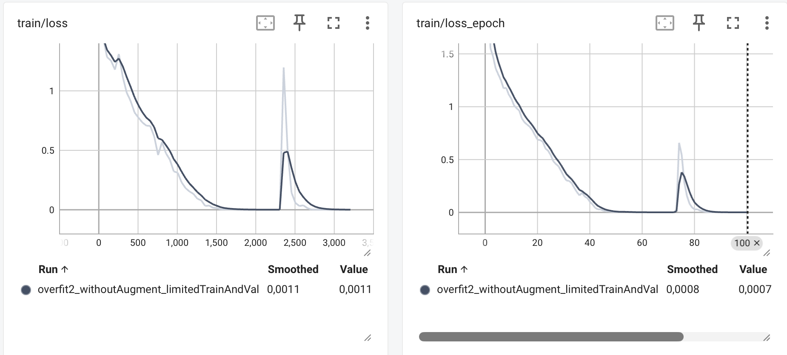

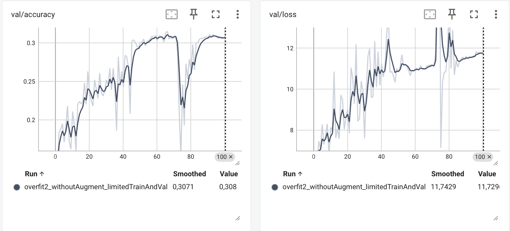


Le modèle fait chuter train/loss vers 0 (environ 0.001), ce qui indique une mémorisation du petit train. En parallèle, val/loss augmente (environ 11.7) et val/accuracy plafonne (environ 0.31) : l’écart train/val montre une mauvaise généralisation, donc un overfit.

NB : pour avoir un overfit, j'ai desactivé les augmentations afin de faciliter la mémorisation du modèle

---

## 4) LR finder

- **Méthode** : balayage LR (log-scale), quelques itérations, log `(lr, loss)`
- **Fenêtre stable retenue** : `1e-4 → 1e-2`
- **Choix pour la suite** :
  - **LR** = `1e-3 ou 0.001`
  - **Weight decay** = `1e-4` (valeur classique)


**M4.** Justifiez en 2–3 phrases le choix du **LR** et du **weight decay**.

commande :  python -m src.lr_finder --config configs/config.yaml --min_lr 1e-5 --max_lr 1e-1 --num_iters 200

j'ai deja lancer avec les valeurs par defaut (min_lr=1e-6, max_lr=1), on peut le voir dans la run bleu clair, puis pour y voir plus clairement j'ai lancer une deuxième run en resserant la recherche lr de min_lr 1e-5 à --max_lr 1e-1. (courbe rose foncé).

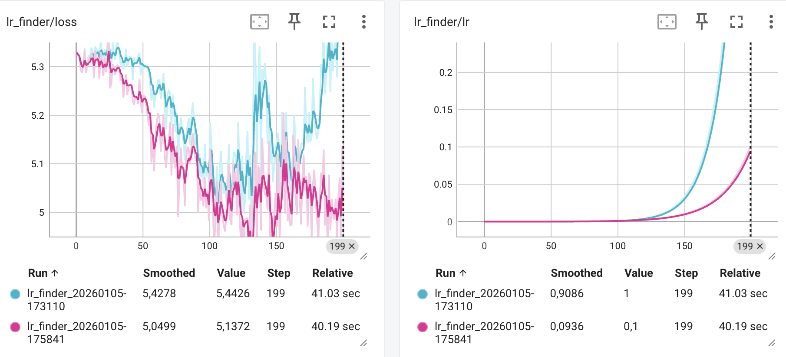

Pour choisir le meilleur Learning Rate à partir de ces graphiques (méthode de Leslie Smith), on ne cherche pas le point où la perte est la plus basse, mais plutôt la zone où elle descend le plus rapidement.

On identifie que la courbe est la plus raide vers le step 100, le LR correspondant est 0.001

Weight decay : Pour Tiny ImageNet, un dataset avec beaucoup de classes mais des images de petite taille (64×64), la valeur 0.0001 est le standard pour Adam. Elle aide la Batch Normalization à mieux généraliser


---

## 5) Mini grid search (rapide)

- **Grilles** :
  - LR : `{0.0005 , 0.001 , 0.002}`
  - Weight decay : `{1e-5, 1e-4}`
  - Hyperparamètre stage_repeats : `{[1,1,1], [2,2,2], [3,3,3]}`
  - Hyperparamètre stage_channels : `{[48,96,192], [64,128,256]}`

  Cela fait 3x2x3x2 = 36 runs.

- **Durée des runs** : `3` époques par run (1–5 selon dataset), même seed

| Run (nom explicite) | LR    | WD   | Hyp-A (stage_channels) | Hyp-B (stage_repeats) | Val metric (nom=val/accuracy @ epoch=3) | Val loss | Notes |
|---------------------|-------|------|------------------------|-----------------------|------------------------------------------|----------|-------|
| gs_034 | 0.002 | 1e-4 | [64, 128, 256] | [2, 2, 2] | 0.2478 | 3,2759 | #1 du grid, bon candidat pour entrainement |
| gs_028 | 0.002 | 1e-5 | [64, 128, 256] | [2, 2, 2] | 0.2424 | 3,2832 | Même arch+LR que 34, teste WD plus faible |
| gs_004 | 0.0005 | 1e-5 | [64, 128, 256] | [2, 2, 2] | 0.2423 | 3,3217 | LR beaucoup plus bas, peut payer sur plus d’epochs |
| gs_016 | 0.001 | 1e-5 | [64, 128, 256] | [2, 2, 2] | 0.2406 | 3,3097 | Compromis LR, proche des meilleurs |
| gs_033  | 0.002 | 1e-4 | [48, 96, 192] | [2, 2, 2] | 0.2398 | 3,3148 | Arch plus petite, potentiellement moins d’overfit |


> _Insérer capture TensorBoard (onglet HParams/Scalars) ou tableau récapitulatif._

**M5.** Présentez la **meilleure combinaison** (selon validation) et commentez l’effet des **2 hyperparamètres de modèle** sur les courbes (stabilité, vitesse, overfit).

Le meilleur run du grid search est gs_034 : LR = 0.002, WD = 1e-4, stage_channels = [64,128,256], stage_repeats = [2,2,2]. Il obtient la meilleure val/accuracy (0.2478) et la meilleure val/loss (3.2759) parmi les runs comparés.

**Effet des 2 hyperparamètres de modèle (channels & repeats) sur les courbes :** 
stage_repeats (profondeur) : passer de [1,1,1] à [2,2,2] accélère clairement l’apprentissage (val/accuracy monte plus vite, val/loss baisse davantage) tout en restant stable. En [3,3,3], le gain n’est pas systématique et la capacité plus élevée peut favoriser un plateau plus tôt / plus d’overfit.

stage_channels (largeur) : [64,128,256] donne en général une meilleure convergence initiale que [48,96,192] (plus de capacité donc meilleure val/accuracy, val/loss plus basse). En contrepartie, la largeur augmente le risque d’overfit si la régularisation est trop faible. Ici, WD=1e-4 aide à garder des courbes propres.

Conclusion : la meilleure config (34) correspond à un bon compromis capacité/stabilité : largeur élevée + profondeur modérée ([64,128,256] et [2,2,2]).

les 36 courbes issues du gridseach (analyse dans le point 7):

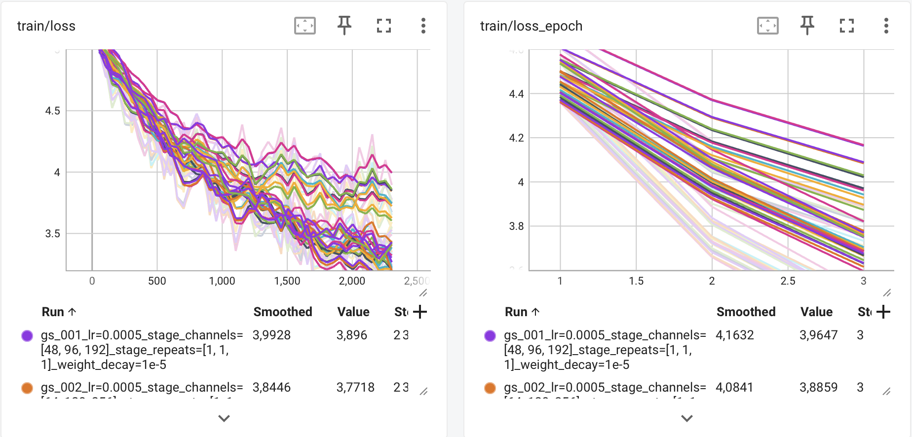

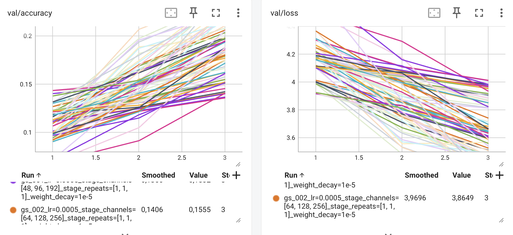

---

## 6) Entraînement complet (10–20 époques, sans scheduler)

- **Configuration finale** :
  - LR = `0.002`
  - Weight decay = `1e-4`
  - Hyperparamètre stage_repeats = `[2,2,2]`
  - Hyperparamètre stage_channels = `[64,128,256]`
  - Batch size = `128`
  - Époques = `20`
- **Checkpoint** : `artifacts/best.ckpt` (selon meilleure métrique val)

> _Insérer captures TensorBoard :_
> - `train/loss`, `val/loss`
> - `val/accuracy` **ou** `val/f1` (classification)

**M6.** Montrez les **courbes train/val** (loss + métrique). Interprétez : sous-apprentissage / sur-apprentissage / stabilité d’entraînement.

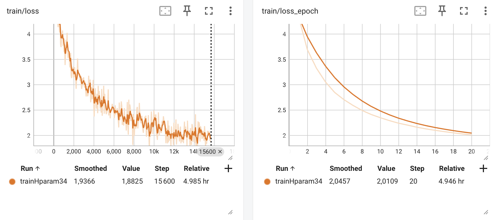

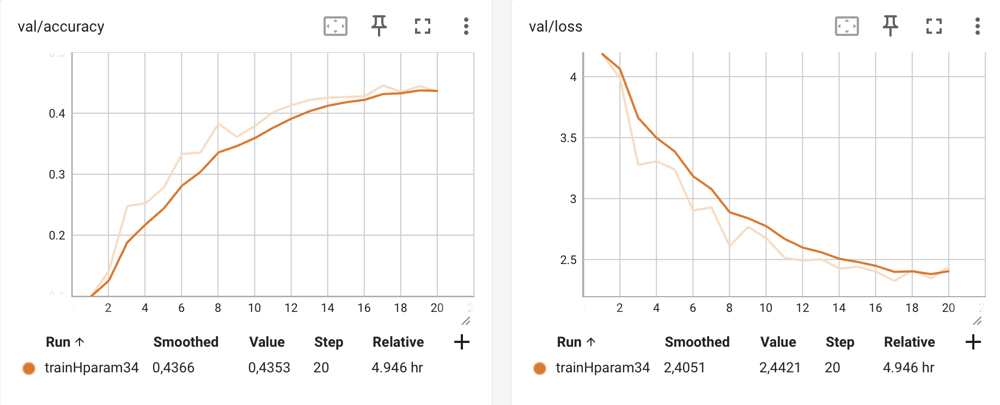

Sur le run 34, l’entraînement est globalement stable : la train/loss diminue régulièrement (avec un bruit normal au niveau batch) et la train/loss_epoch baisse de façon monotone jusqu’à la fin, ce qui indique que le modèle apprend correctement et que le LR n’est pas trop élevé (pas de divergence). Côté validation, la val/accuracy augmente fortement au début puis atteint un plateau autour de 0.43–0.44. La val/loss diminue nettement sur les premières epochs, puis stagne/oscille légèrement en fin d’entraînement.
Cette stagnation ressemble davantage à un plateau dû à l’absence de scheduler (LR constant) qu’à un sur-apprentissage marqué : on ne voit pas de remontée franche et durable de la val/loss ni une baisse nette de val/accuracy. Le modèle n’est probablement pas en sous-apprentissage, et l’overfit semble au plus léger. On est surtout limité par le fait qu’en fin d’entraînement, une réduction du LR aurait probablement été nécessaire pour continuer à améliorer la généralisation.

---

## 7) Comparaisons de courbes (analyse)

> _Superposez plusieurs runs dans TensorBoard et insérez 2–3 captures :_

- **Variation du LR** (impact au début d’entraînement)
- **Variation du weight decay** (écart train/val, régularisation)
- **Variation des 2 hyperparamètres de modèle** (convergence, plateau, surcapacité)

**M7.** Trois **comparaisons** commentées (une phrase chacune) : LR, weight decay, hyperparamètres modèle — ce que vous attendiez vs. ce que vous observez.


### comparaison du weight decay (20 epochs)


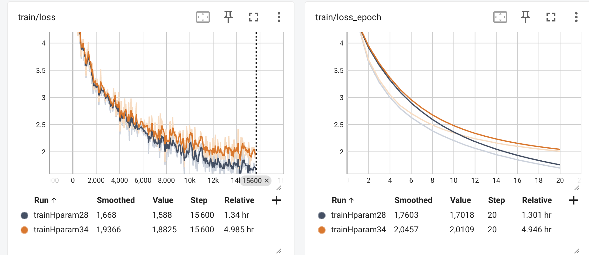
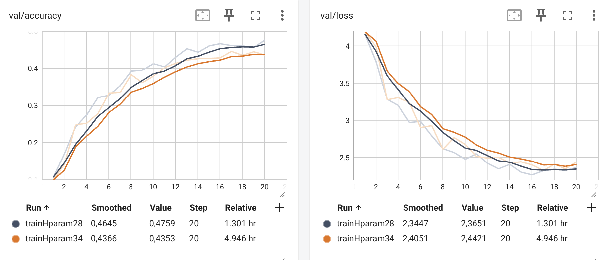
(même architecture sauf le weight decay, voir tableau point 5, run 34vs run 28)

Je m'attendais à que le modèle (28) généralise moins bien avec un weight decay plus bas mais finalement le run 28 montre l’inverse, avec une val/accuracy plus élevée et une val/loss plus faible, ce qui suggère que WD=1e-4 était trop régularisant et limitait l’apprentissage.


## changement du LR (20 epochs)


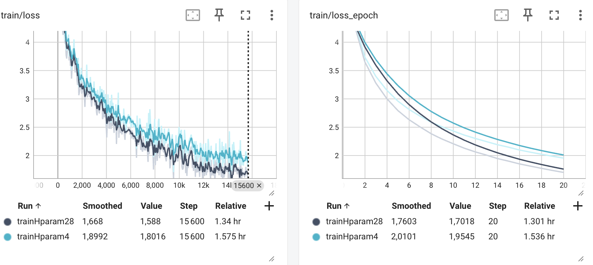

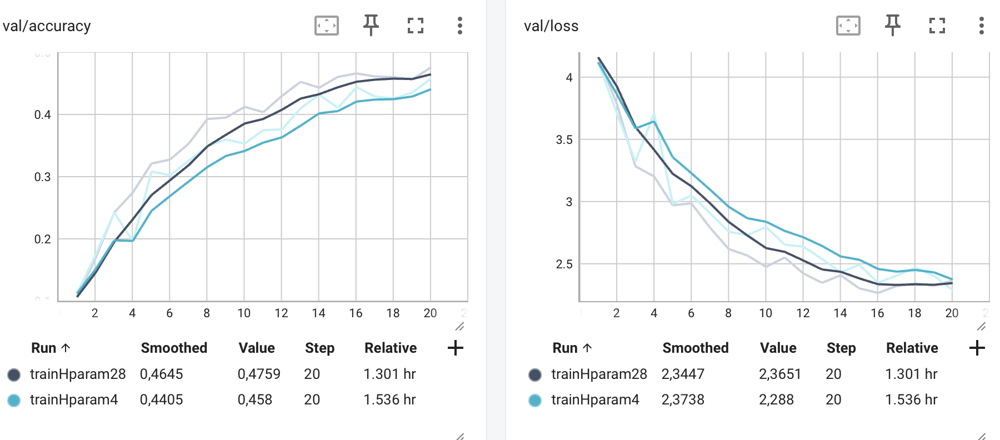
(même architecture sauf le LR, voir tableau point 5, run 4 vs run 28)

Je m’attendais à ce qu’avec un LR plus faible, on apprenne moins vite au début puis qu’on rattrape (voire dépasse) à la fin, mais les graphiques montrent qu’à 20 epochs le run 4 reste derrière en val/accuracy, même s’il a une val/loss plus faible, ce qui suggère qu’il est simplement plus lent et qu’il aurait probablement besoin de plus d’epochs pour rattraper.

### comparaison stage_channel (3 epochs)

**bleu foncé** : gs_027_lr=0.002_stage_channels=[48, 96, 192]_stage_repeats=[2, 2, 2]_weight_decay=1e-5 

**rose** : gs_028_lr=0.002_stage_channels=[64, 128, 256]_stage_repeats=[2, 2, 2]_weight_decay=1e-5

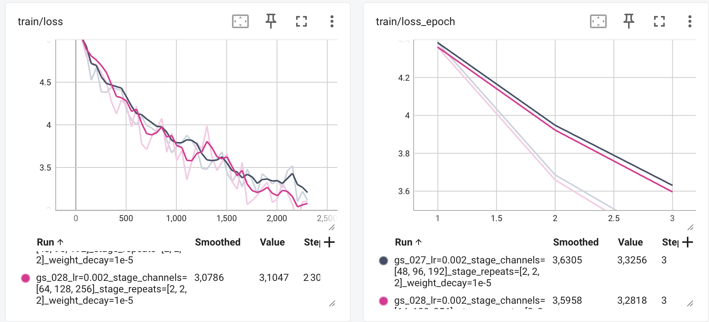

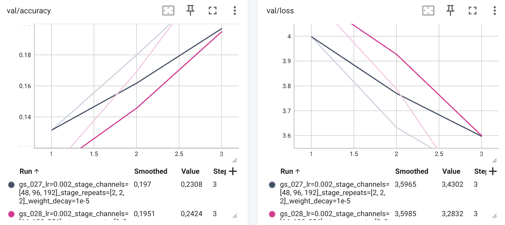

Avec un LR/WD et repeats identiques, augmenter stage_channels de [48,96,192] (bleu) à [64,128,256] (rose) améliore les performances (train/loss et val/loss plus faibles, val/accuracy plus élevée), ce qui nous dit qu’un modèle plus large apprend et généralise mieux à court terme.


---

## 8) Itération supplémentaire (si temps)

- **Changement(s)** : `Weight decay` 
- **Résultat** : `val/accuracy de environ 0,47`

**M8.** Décrivez cette itération, la motivation et le résultat.

Étant donné que mon grid search était volontairement court (3 epochs par run par contrainte de compute), plusieurs configurations obtenaient des résultats très proches (en particulier run 34 vs run 28), ce qui rendait le classement "flou" à si peu d’epochs. J’ai donc réalisé une itération supplémentaire en approfondissant l’entraînement (20 epochs) de la seconde configuration “gagnante” du grid search (run 28), afin de tester l’effet d’un weight decay plus faible à architecture et learning rate identiques (WD 1e-5 au lieu de 1e-4). J’ai également entraîné la run 4 (LR plus faible) comme point de comparaison.

La configuration 28 à montré de meilleurs resultats.

(Résulat visible au point 7, comparaison du weight decay.) 


---

## 9) Évaluation finale (test)

- **Checkpoint évalué** : `artifacts/best.ckpt`
- **Métriques test** :
  - Metric principale `accuracy` : `0.4759`
  - Metric(s) secondaire(s) : `loss`: `2.3651`

**M9.** Donnez les **résultats test** et comparez-les à la validation (écart raisonnable ? surapprentissage probable ?).

Sur le jeu évalué, le modèle obtient une accuracy de 0.4759 (loss 2.3651). Dans mon pipeline, le dataset `zh-plus/tiny-imagenet` ne fournissait pas de split test annoté exploitable. J’ai donc évalué le modèle sur le split validation, que je reporte ici comme “test”. Cette évaluation n’étant pas totalement indépendante et est un peu optimiste. Néanmoins, l’entraînement inclut plusieurs mécanismes qui limitent le sur-apprentissage (augmentations de données, régularisation avec weight decay...), ce qui rend peu probable un écart massif entre cette estimation et une évaluation sur un vrai jeu de test séparé.


---

## 10) Limites, erreurs & bug diary (court)

- **Limites connues** (données, compute, modèle) :
  - grid search limité à 3 epochs par configuration (contraintes de compute, résultats parfois serrés)
  - dataset zh-plus/tiny-imagenet sans split test annoté exploitable (évaluation finale réalisée sur la validation)
- **Erreurs rencontrées** 
  AdamW a un temps de calcul nettement plus long que Adam sur MPS, ce qui a limité mes itérations. C’est dommage car AdamW est en général mieux adapté lorsque l’on utilise du weight decay, car il le décorrèle de la mise à jour d’Adam. (run_lr00-1_wd0-0001)
 **solutions** :
 Je suis resté sur Adam pour conserver un temps d’entraînement raisonnable et pouvoir explorer plus de configurations.
- **Idées « si plus de temps/compute »** (une phrase) :
J’aimerais tester un scheduler et pousser l’entraînement vers 100 epochs pour vérifier si les configurations à plus faible LR finissent par rattraper ou dépasser. 

- **Choix**
J’ai choisi de réaliser ce projet sur ma machine personnelle pour apprendre à travailler avec mon propre matériel et vérifier que je pouvais entraîner un modèle de machine learning dans de bonnes conditions. J’ai aussi fait quelques runs dédiés à l’optimisation des performances (ils ne sont pas inclus dans le dépôt final). Sur MacBook Pro M1 (MPS), j’ai constaté qu’un faible nombre de workers est préférable, et qu’augmenter le batch size n’accélère l’entraînement que marginalement. J’ai ajouté une option cache_in_ram, mais elle n’a malheureusement pas apporté de gain significatif. Je suspecte que le goulot d’étranglement ne venait pas du chargement brut des fichiers mais plus du prétraitement des images et du transfert des batchs vers le GPU (MPS), ce qui limite l’impact du caching.

---

## 11) Reproductibilité

- **Seed** : `42`
- **Config utilisée** : joindre un extrait de `configs/config.yaml` (sections pertinentes)

```
stage_repeats: [2, 2, 2]   # (N1,N2,N3) dans {1,2,3}
stage_channels: [64, 128, 256]  # (C1,C2,C3)

train:
  seed: 42
  device: auto              # "cpu", "cuda", "mps", ou "auto"
  batch_size: 128
  epochs: 20
  max_steps: null           # entier ou null
  overfit_small: false      # true pour sur-apprendre sur un petit échantillon
  #overfit_small_size: 4096   # taille du sous-échantillon quand overfit_small=true
  val_subset_size: null      # optionnel: nombre d'exemples utilisés pour la validation (null = tout)

  optimizer:
    name: adam              # sgd/adam/adamw/rmsprop
    lr: 0.002
    weight_decay: 1e-5
    momentum: 0.9  
```

- **Commandes exactes** :

```bash
.venv/bin/tensorboard --logdir runs --port 6006
python -m src.train --config configs/config.yaml --max_epochs 15
python -m src.evaluate --config configs/config.yaml --checkpoint artifacts/best.ckpt
````

* **Artifacts requis présents** :

  * [ ] `runs/` (runs utiles uniquement)
  * [ ] `artifacts/best.ckpt`
  * [ ] `configs/config.yaml` aligné avec la meilleure config

---

## 12) Références (courtes)

* PyTorch docs des modules utilisés (Conv2d, BatchNorm, ReLU, LSTM/GRU, transforms, etc.).

  - Conv2d : https://pytorch.org/docs/stable/generated/torch.nn.Conv2d.html
  - BatchNorm2d : https://pytorch.org/docs/stable/generated/torch.nn.BatchNorm2d.html
  - ReLU : https://pytorch.org/docs/stable/generated/torch.nn.ReLU.html
  MaxPool2d : https://pytorch.org/docs/stable/generated/torch.nn.MaxPool2d.html
  - AdaptiveAvgPool2d : https://pytorch.org/docs/stable/generated/torch.nn.AdaptiveAvgPool2d.html
  - Linear : https://pytorch.org/docs/stable/generated/torch.nn.Linear.html
  - CrossEntropyLoss : https://pytorch.org/docs/stable/generated/torch.nn.CrossEntropyLoss.html
  - transforms (vision) : https://pytorch.org/vision/stable/transforms.html

* Lien dataset officiel (et/ou HuggingFace/torchvision/torchaudio).

  -  https://huggingface.co/datasets/zh-plus/tiny-imagenet

* Toute ressource externe substantielle (une ligne par référence).
  - https://www-inf.telecom-sudparis.eu/COURS/CSC8607/Supports/?page=main
  - aide au code : Chatgpt 5.2 thinking et Gemini 3 pro


